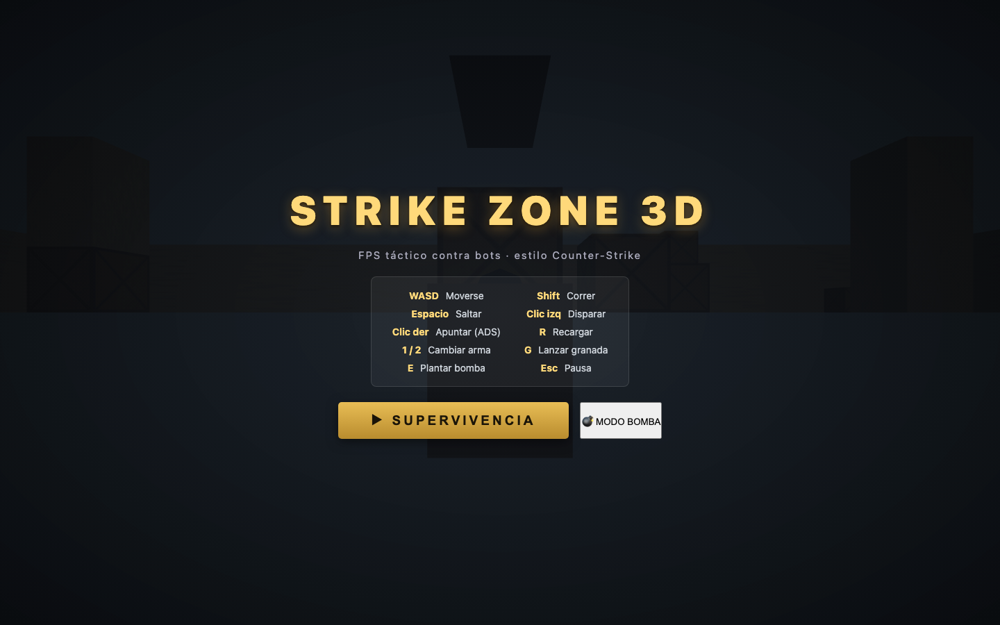
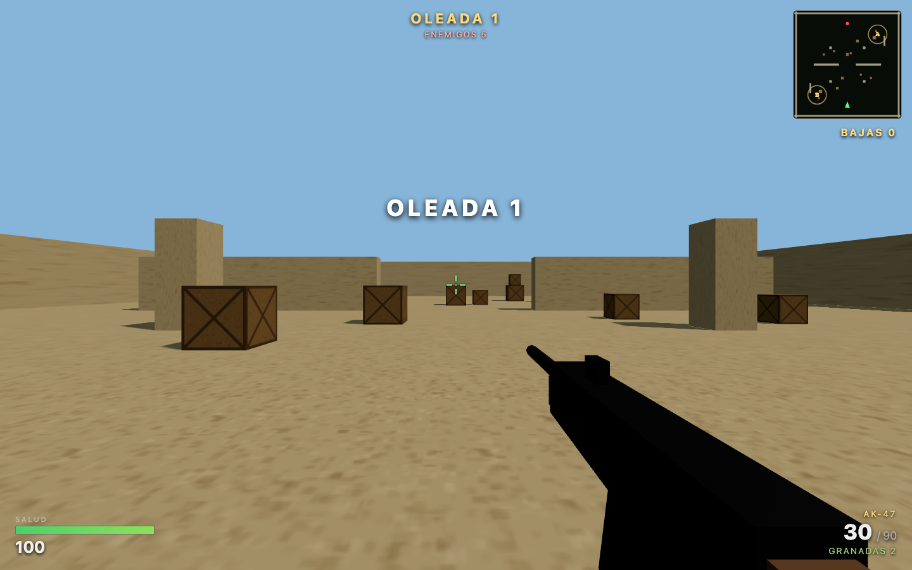
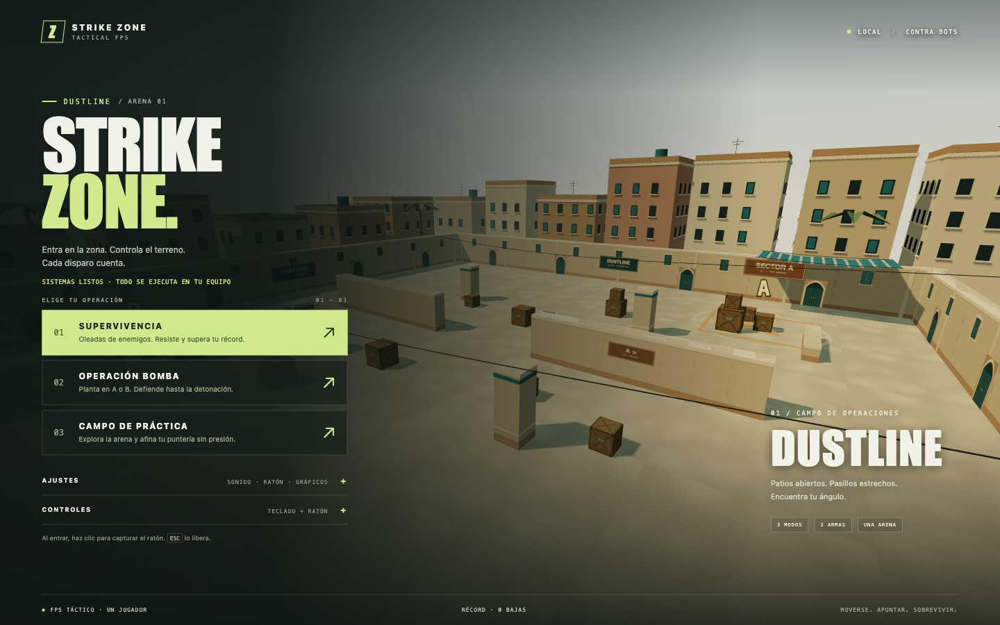
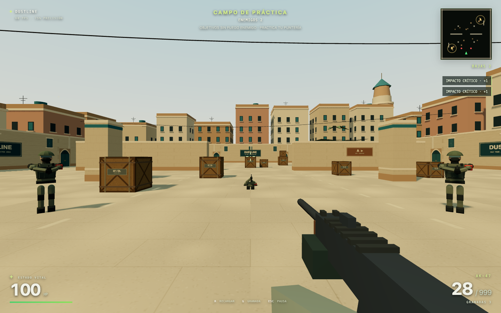
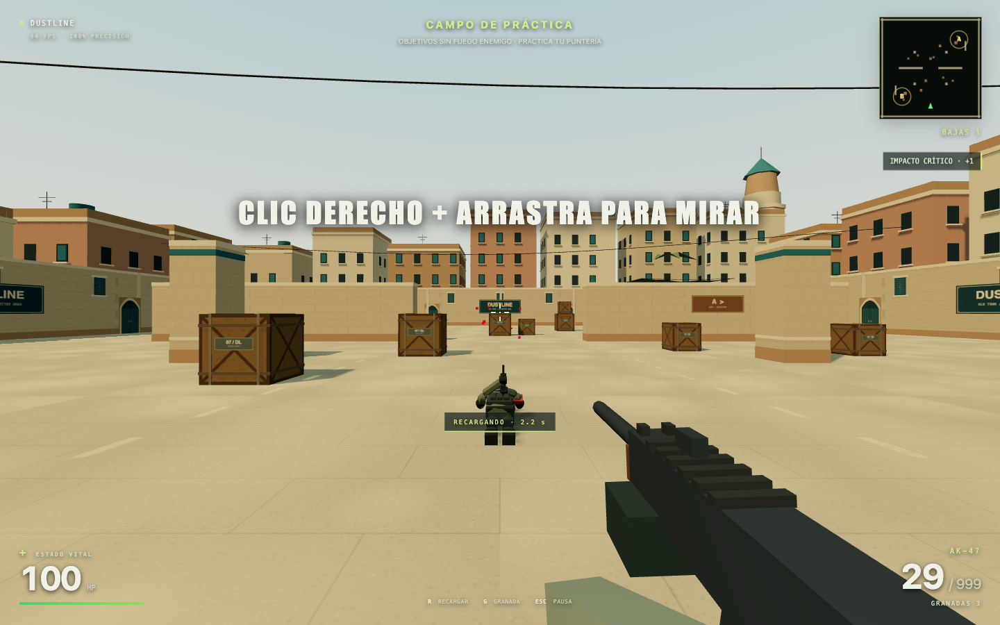
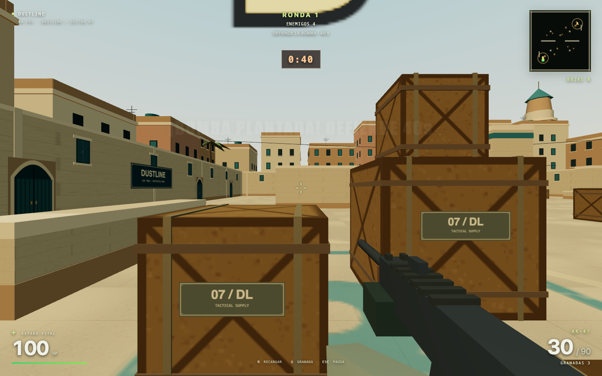
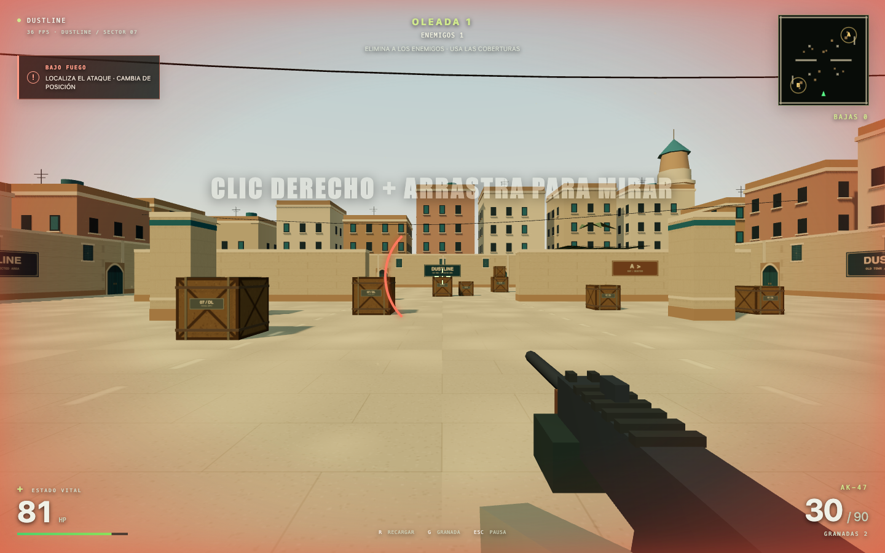
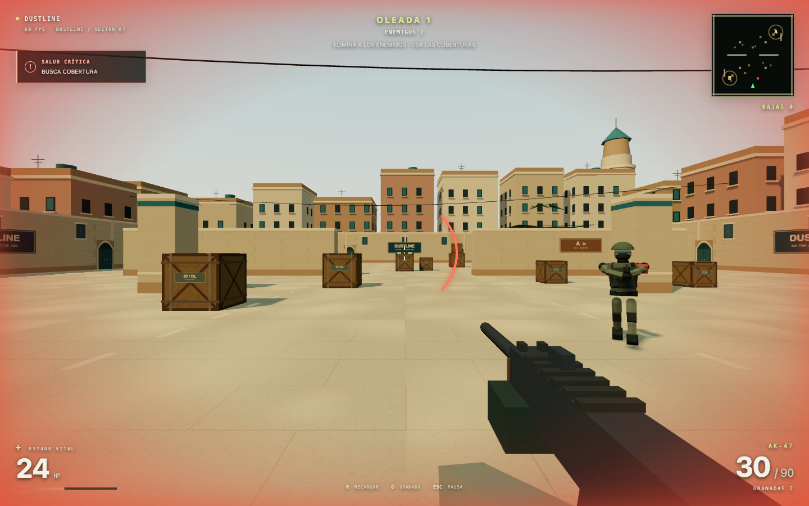

# Strike Zone · Dustline — mejoras y estado actual

**Fecha: 22 de septiembre de 2026 · America/Santiago**  
**Versión local del proyecto: 2.1.0**

El proyecto recibido se convirtió en una versión local más completa y comprobable: mantiene su combate FPS y sus dos modos originales, incorpora un campo de práctica, renueva escenario e interfaz, amplía animación y audio y corrige problemas de control, física y transiciones. Se puede iniciar con `npm start` y jugar sin descargar recursos externos.

Este documento registra la intervención posterior. El estado previo está congelado en [ESTADO_INICIAL_KIMI_K3.md](ESTADO_INICIAL_KIMI_K3.md) y los cuatro archivos originales en [baseline/](baseline/). El nombre Kimi K3 corresponde al contexto aportado por el usuario: no existe historial Git suficiente para verificar la autoría de esos archivos ni las horas dedicadas. No se atribuyen a esta intervención los sistemas que ya existían.

## 1. Qué había y qué se añadió

El original ya era un prototipo FPS sustancial: 1.741 líneas entre cuatro archivos, arena de 60 × 60 unidades, 30 piezas sólidas, AK-47 y USP, bots, granadas, supervivencia, bomba, HUD, minimapa, sombras, texturas procedurales, animaciones básicas y sonido sintetizado. La mejora parte de esa base; no representa una creación desde cero.

| Área | Estado recibido | Estado posterior |
|---|---|---|
| Ejecución | Servidor HTTP manual y Three.js desde CDN | Servidor Node sin dependencias de ejecución; Three.js y licencia locales; mensaje recuperable ante fallo de arranque |
| Inicio y pausa | Dependencia de Pointer Lock; rechazo silencioso | Captura con gestión de errores, partida pausada hasta disponer de control y alternativa visible sin captura |
| Modos | Supervivencia y operación bomba | Se conservan ambos y se añade campo de práctica con objetivos que reaparecen |
| Física | Integración por fotograma y salto dependiente de FPS | Simulación de paso fijo a 120 Hz y resolución mejorada de superposición sin velocidad |
| IA de movimiento | Persecución directa y desplazamiento lateral aleatorio | A* con margen para el cuerpo, diagonales seguras y comprobación de aristas contra obstáculos |
| Escenario | Muros, cajas, pilares y suelo con tres texturas | Barrio desértico estilizado con edificios, fachadas, señalética, palmeras, minarete, telas, cables y polvo |
| Armas y presentación | Modelos básicos, retroceso, balanceo y recarga por inclinación | Más detalles, manos y mangas, movimiento de mano y cargador durante recarga, respiración y presentación revisada |
| Audio | Efectos sintetizados; armas con sonido compartido | Firmas distintas por arma, mezcla por buses, paneo estéreo, reverberación, viento, compresor, volumen y silencio |
| Interfaz | Menú y HUD funcionales básicos | Menú de modos, ajustes, HUD renovado, mensajes de objetivo, registro de bajas, precisión y récord local |
| Verificación | Sin pruebas automatizadas | Pruebas unitarias, pruebas de navegador, capturas y resultados reproducibles |

## 2. Cómo ejecutarlo y jugar

Desde la raíz del proyecto, con Node.js 20 o posterior:

```bash
npm start
```

Abrir [http://127.0.0.1:8123](http://127.0.0.1:8123). No se necesita `npm install` para jugar. Otra opción es `python3 -m http.server 8123 --bind 127.0.0.1`. Debe servirse por HTTP; abrir el HTML con `file://` no es el flujo soportado.

Se recomienda empezar por **Campo de práctica**: presenta tres objetivos sin fuego enemigo, restablece la reserva a 999 y repone granadas. Los cargadores siguen consumiéndose y hay que recargar. Al eliminar todos los objetivos aparece otro grupo. Así se puede comprobar puntería, animación, recarga y sonido sin que una oleada interrumpa la familiarización.

| Control | Acción |
|---|---|
| WASD | Moverse |
| Shift + avance | Correr |
| Espacio | Saltar, una vez por pulsación |
| Clic izquierdo | Disparar; mantener para fuego automático con AK-47 |
| Clic derecho | Apuntar |
| 1 / 2 | Elegir AK-47 / USP |
| R | Recargar |
| G | Lanzar granada |
| E mantenida | Plantar dentro de A/B, quieto y apoyado en el suelo |
| M | Silenciar o restaurar sonido |
| Esc | Pausar |

Si el navegador rechaza capturar el ratón, el menú ofrece **Jugar sin captura**. En ese modo, clic derecho y arrastrar permite mirar/apuntar; las flechas también giran la cámara. WASD, disparo y el resto de acciones permanecen disponibles.

**Supervivencia:** conserva las oleadas crecientes; al completarlas se recuperan 30 PV hasta el máximo de 100, cargadores, reservas y granadas. La progresión considera enemigos vivos, por lo que no depende de esperar a que desaparezcan todos los cadáveres.

**Operación bomba:** mantener E durante 3,2 segundos dentro de un sitio válido planta el explosivo. La cuenta atrás es de 40 segundos y el umbral de desactivación de 5 segundos. Detonar avanza a la siguiente ronda; desactivar provoca repetir la ronda. Se conserva la estructura original del modo, con correcciones de coherencia y transición.

## 3. Fallos corregidos y comportamiento resultante

### Control e inicio

- La solicitud de captura ahora atiende excepciones, promesas rechazadas y `pointerlockerror`. Un rechazo deja un menú utilizable y una alternativa de control; no deja correr una partida que el usuario no puede manejar.
- Perder foco o esconder la pestaña pausa y limpia las entradas. Al reanudar no queda una tecla de movimiento o disparo atascada.
- Las acciones discretas ignoran la repetición de teclado. Mantener G no lanza sucesivamente todo el inventario, y mantener Espacio no provoca saltos continuos al aterrizar.
- Los botones de modo se habilitan cuando termina el arranque. `bootstrap.js` presenta un error visible si falla la carga del módulo principal o la inicialización gráfica.

### Movimiento, combate y estados

- La simulación avanza en pasos de **1/120 s**. El renderizado puede tener otra frecuencia. La prueba aislada reproduce el mismo salto y desplazamiento a 20, 30, 60 y 120 FPS de presentación: pico de aproximadamente **1,494 m** en todos esos casos.
- Una superposición sin velocidad se resuelve hacia la cara más cercana. Esto evita que la separación de una multitud expulse siempre al personaje hacia el lado positivo de un muro.
- Un clic breve dispara inmediatamente el rifle; el original podía perder la pulsación si ocurría entre dos fotogramas.
- La cámara y sus matrices se sincronizan para el disparo, incluido el fuego automático. El raycast deja de depender de la pose visual del fotograma anterior.
- El intermedio de bomba se procesa antes de continuar combate. El daño al jugador también ignora el estado de fin de ronda.
- Un reinicio de ronda limpia granadas, efectos, entradas, temporizadores de recarga/cambio y retroceso. El reinicio completo restablece vida, armas, munición, estadísticas y objetivos.
- Plantar exige suelo, altura válida, poca velocidad horizontal y ausencia de disparo/recarga. La posición de la malla se obtiene de la misma posición lógica de la bomba.
- La desactivación requiere cercanía y línea de visión hasta el explosivo. El HUD se actualiza tanto al detonar como al desactivar.
- Se retiran y liberan recursos de enemigos y bombas al descartarlos; las partículas usan un conjunto reutilizable para contener creación de objetos durante el combate.

**Límite que permanece:** el progreso de desactivación continúa siendo compartido y decae al perder acceso; no se implementó un único desactivador con progreso individual. El informe inicial planteaba esa posibilidad, pero no debe confundirse con una función completada.

### Navegación

`navigation.js` convierte la arena en una cuadrícula de 40 × 40 celdas de 1,5 unidades. Expande los obstáculos por el radio del enemigo, selecciona una celda libre cercana para los extremos y busca una ruta A*.

Las diagonales requieren ambos lados libres para no cortar esquinas. Además, se precalcula si el segmento entre celdas atraviesa una caja de colisión: durante las pruebas se detectó que un muro muy delgado podía quedar entre dos centros libres y la implementación inicial lo atravesaba. Esa regresión quedó cubierta y corregida. La comprobación geométrica se paga al construir la cuadrícula, no en cada consulta de cada bot.

En una comprobación local con el mapa real se encontraron las **21 rutas** entre sus siete spawns y tres destinos de referencia: inicio del jugador, A y B. Esta comprobación confirma conectividad de esos casos; no equivale a garantizar que toda persecución o situación de multitud esté libre de atascos.

## 4. Gráficos y animaciones

El mapa conserva sus coberturas y límites físicos. La renovación de `world-detail.js` añade arquitectura exterior para dar profundidad y superficies decorativas casi pegadas a los muros existentes. Las telas están por encima de la altura de salto. No se añadieron objetos voluminosos decorativos en los pasillos que parezcan sólidos pero se puedan atravesar.

Los elementos nuevos son:

- Ciudad exterior con volúmenes de alturas distintas, ventanas, cornisas, parapetos, depósitos de agua y antenas.
- Minarete y palmeras como referencias visuales sobre el perímetro.
- Fachadas interiores con persianas, portones de arco y letreros DUSTLINE / SECTOR A / SECTOR B.
- Suelo de losas con arena y desgaste; pintura de navegación y objetivos sobre el pavimento.
- Herrajes, listones y etiquetas en las cajas originales.
- Cielo con degradado, niebla cálida, iluminación de sol y contraste entre arena y tonos verde azulado.
- Cables elevados, toldos que se deforman suavemente con el viento y partículas de polvo discretas.

Las armas conservan su animación procedural y amplían la lectura de las acciones: mano de apoyo y cargador se desplazan al recargar, el arma responde al retroceso, se inclina al cambiar y presenta movimiento de respiración, caminata y ADS.

`enemy-model.js` reemplaza la silueta de bloques del soldado por torso afinado, extremidades redondeadas, casco, visor, máscara, chaleco, correas, bolsas, rodilleras, botas y rifle detallado. Las piernas pivotan desde las caderas y su equipo sigue ese movimiento; el arma sigue el brazo derecho al retroceder. Las piezas visibles de cabeza, casco, visor y máscara conservan identificación de impacto en cabeza. El modelo mide aproximadamente 1,79 unidades y utiliza 18 mallas y 1.998 triángulos; el equipo está combinado por material para moderar las llamadas de dibujo. Se mantienen respuesta al daño y caída procedural. No se utilizan animaciones capturadas ni personajes importados de una librería comercial.

### Coste gráfico y ajustes

Se agrupan las piezas repetidas con `InstancedMesh`, incluidas las 28 hojas de palmera en una sola malla. El inventario completo del módulo ambiental, antes del descarte por cámara, es de **1.730 instancias**, aproximadamente **23.744 triángulos**, **115 llamadas de dibujo** y hasta **26 llamadas adicionales para sus sombras**. Son cifras del módulo ambiental; no incluyen todo el coste de personajes, armas y efectos.

El ajuste **Rendimiento** limita la resolución interna, desactiva sombras y polvo y detiene la animación de telas. **Alta** mantiene esas prestaciones, con límite de densidad de píxeles de 1,75. El HUD muestra los FPS observados.

En una observación puntual con Chromium visible a 1280 × 800 y tres bots, el contador mostró **60 FPS**, 168 llamadas de dibujo y 23.990 triángulos. Esa observación corresponde a la versión anterior a integrar el último modelo de enemigo; no es una medición del coste final de ese modelo ni una prueba sostenida de todas las oleadas.

Estos datos describen decisiones y presupuesto geométrico; **no son una promesa de 60 FPS ni un benchmark representativo de todas las GPU**. La fluidez depende del equipo, navegador, tamaño de ventana y carga de la partida.

## 5. Audio

El módulo `audio.js` genera todo el sonido con Web Audio. No descarga muestras ni exige servicios externos. El rifle y la pistola tienen transitorios y cuerpo diferentes; la recarga combina etapas, y los impactos, pasos, granadas, explosiones y avisos utilizan varias capas.

El sonido enemigo conserva atenuación por distancia y añade paneo estéreo. Un impulso de reverberación sintetizado aporta una cola breve; viento filtrado con variación lenta acompaña la arena. Un compresor limita la acumulación de señales antes del control de volumen maestro.

La pausa cierra los buses de efectos y ambiente. Los avisos de muerte disponen de un bus separado para poder sonar después de pausar sin reactivar el viento ni los disparos. Las fuentes temporales desconectan sus nodos al finalizar. Si el navegador no admite o bloquea audio, esa condición no impide jugar.

**Alcance de la verificación:** las pruebas unitarias comprueban conexiones, temporización, paneo, silencio y liberación de nodos mediante un contexto controlado. La prueba de navegador observa señal PCM real a la salida de Web Audio y comprueba que el silencio la reduce. Eso demuestra que se genera señal y que el control funciona; **no sustituye una escucha humana ni certifica la calidad subjetiva de la mezcla**.

## 6. Interfaz y persistencia

El menú muestra los tres modos con descripciones y controles, opciones de continuar/reintentar y estado de carga. Los ajustes permiten cambiar volumen, sensibilidad y calidad gráfica. El diseño se adapta a ventanas estrechas y muestra un aviso de que el juego requiere teclado y ratón; esa adaptación no convierte el juego en táctil.

Durante la partida se presentan objetivo, salud, arma y munición, inventario de granadas, bajas, mensajes de recarga, minimapa y avisos de bomba. La práctica añade porcentaje de precisión. El récord de bajas fuera de práctica y los ajustes se guardan en `localStorage`; no hay cuenta, backend ni envío de estas preferencias a terceros.

## 7. Arquitectura y ejecución sin servicios externos

| Archivo o carpeta | Responsabilidad |
|---|---|
| `index.html`, `style.css` | Menú, HUD, ajustes, estados y disposición adaptable |
| `bootstrap.js` | Arranque del módulo principal y recuperación visible de errores |
| `main.js` | Estado de partida, input, armas, daño, modos, cámara y simulación fija |
| `world-detail.js` | Materiales y geometría ambiental, instancias, cielo, polvo y telas |
| `enemy-model.js` | Soldado procedural articulado, equipo agrupado por material y mallas de impacto |
| `navigation.js` | Cuadrícula, margen de colisión y búsqueda A* |
| `physics.js` | Movimiento por ejes y resolución de colisiones |
| `audio.js` | Síntesis, mezcla, pasos enemigos, avisos, paneo, volumen, pausa y ciclo de vida de voces |
| `combat-feedback.js` | Estado temporal de amenaza, daño direccional, pulso crítico y cadencia de avisos |
| `server.mjs` | Servidor HTTP estático local con módulos nativos de Node |
| `vendor/three.module.js` | Three.js 0.160.0 conservado localmente |
| `vendor/THREE-LICENSE.txt` | Licencia MIT de Three.js |
| `tests/` | Pruebas unitarias y de navegador |
| `docs/baseline/` | Copia inalterada de lo recibido |
| `docs/evidence/` | Capturas y resultados de la verificación |

El código del juego, Three.js, texturas, geometría y sonidos están disponibles localmente. Una vez descargado el proyecto, jugar no depende del CDN original. Instalar Playwright y su Chromium para ejecutar pruebas sí puede necesitar conexión la primera vez; es una dependencia de desarrollo, no de la partida.

## 8. Verificación y sus límites

### Pruebas unitarias

Se ejecutó `npm run test:unit`: **26 aprobadas, 0 fallidas** tras la segunda iteración.

| Suite | Casos | Qué verifica |
|---|---:|---|
| Física | 7 | Suelo, igualdad del salto entre tasas de renderizado, muros y deslizamiento, superposición sin velocidad, techo, apoyo sobre caja y límites de arena |
| Navegación | 8 | Plano y ruta corta, rodeo de cobertura, diagonales, extremos ocupados, objetivo aislado, mapa totalmente bloqueado, geometría elevada y paredes delgadas |
| Audio | 6 | Fallback, muerte tras pausa, buses, paneo, silencio, limpieza; pasos con distancia/oclusión y nuevos avisos |
| Respuesta de combate | 5 | Dirección relativa, duración del impacto, prioridades, cadencia de avisos, reinicio y efectos reducidos |
| **Total** | **26** | **Sin fallos en la ejecución registrada** |

### Pruebas en Chromium

**25 comprobaciones aprobadas, 0 errores JavaScript y 0 peticiones externas**, ejecutadas con Chromium 151.0.7922.34 visible. Resultado consolidado: [browser-results.json](evidence/browser-results.json). Salida de pruebas unitarias: [unit-results.txt](evidence/unit-results.txt).

La comprobación incluye ambos resultados de la bomba: detonación con avance de ronda y desactivación con repetición, además del rechazo del plantado en el aire. Después se verificó también el servidor propio y la URL normal sin fixtures: inicio, disparo, ocultación del HUD al pausar, reanudación y menú estrecho.

La suite recorre inicio, práctica, movimiento, salto, colisión, disparo e impacto, recarga, pistola semiautomática, ADS, granada, audio, silencio, pausa, ajustes, supervivencia, muerte/reinicio, bomba y adaptación a ventana estrecha. También registra errores JavaScript y peticiones externas. La segunda iteración añade **11 comprobaciones de respuesta al combate**, todas aprobadas: **36 comprobaciones de navegador en total**; ver [combat-results.json](evidence/combat-results.json).

Durante la ejecución automatizada, la captura nativa del ratón de Chromium falló con **`WrongDocumentError`**. La partida se probó con la alternativa real de control que implementa el juego. No se sustituyó Pointer Lock por una API ficticia para presentar una captura exitosa. Se incluye además un caso separado que rechaza deliberadamente la solicitud para comprobar que el menú se recupera.

Los movimientos y disparos de las pruebas usan entradas de teclado y ratón. Los casos límite se preparan con **fixtures** accesibles únicamente al abrir la URL local con `?test=1`: colocar al jugador junto a una pared o un sitio, crear un blanco, eliminar enemigos, acelerar el final de la cuenta atrás, acercar un desactivador o aplicar daño letal. Estas preparaciones hacen reproducibles las transiciones; **no representan una victoria lograda por una persona durante una partida completa**.

La prueba de audio instrumenta un analizador conectado a la salida real de Web Audio. No reemplaza los osciladores ni las fuentes del juego. Sus medidas de señal son evidencia técnica, con el límite de escucha descrito en la sección de audio.

Para repetir la verificación:

```bash
npm ci
npx playwright install chromium
npm run test:unit
npm run test:browser
```

`npm test` ejecuta ambas partes. `HEADED=1 npm run test:browser` muestra la ventana de Chromium. `TEST_URL=http://127.0.0.1:8124 npm run test:browser` permite elegir otro servidor local.

## 9. Evidencia visual

Las siguientes imágenes proceden de la ejecución del proyecto. Sirven para comparar presentación y estados concretos; una captura estática no demuestra por sí sola fluidez, sonido o una partida completada.

### Antes: menú recibido



### Antes: arena y arma originales



### Después: menú y selección de modos



### Después: escenario y HUD en partida



### Después: estado de recarga



### Después: bomba plantada



## 10. Estado de alcance y limitaciones

- Es un FPS de un jugador para escritorio con teclado y ratón; no incluye multijugador, controles táctiles ni mando.
- El acabado es 3D estilizado y procedural. No hay modelos GLTF de alta fidelidad, animación esquelética importada, captura de movimiento ni audio grabado profesionalmente.
- La IA usa navegación de cuadrícula, separación y maniobras locales. Los tests cubren rutas y regresiones concretas, no todas las posibles multitudes ni posiciones sobre coberturas.
- El fuego enemigo conserva el modelo probabilístico del prototipo; no se convirtió toda la simulación en balística física.
- La operación bomba conserva un único mapa, progreso compartido de desactivación y ausencia de tiempo límite previo al plantado. No incorpora economía, equipos, compra de armas o campaña.
- La práctica repone reserva y granadas para ensayar; ese suministro no describe las reglas de supervivencia ni de bomba.
- La captura nativa del ratón no quedó validada exitosamente en el entorno Chromium automatizado de esta sesión. Existe y se verifica la alternativa sin captura.
- No se afirma compatibilidad exhaustiva con Safari, Firefox, móviles, GPU antiguas o sesiones de muchas horas, ni un rendimiento mínimo garantizado en otros equipos.
- La verificación de señal de audio no equivale a una evaluación humana de timbre, equilibrio o comodidad de escucha.

La separación entre [estado inicial](ESTADO_INICIAL_KIMI_K3.md), [archivos originales](baseline/) y este documento permite revisar qué capacidades se heredaron y qué cambió después, sin convertir líneas de código o cantidad de pruebas en una estimación de horas o un porcentaje artificial de trabajo.


## 11. Segunda iteración: sentir la amenaza y los impactos

**22 de septiembre de 2026 · versión 2.1.0.** Esta iteración responde a la observación del usuario: faltaba una respuesta perceptible al acercarse los enemigos y recibir disparos. Se conserva la referencia inicial de Kimi sin modificaciones.

### Cambios en esta iteración

- **Impacto rojo perceptible:** los bordes se iluminan al recibir daño y se desvanecen durante aproximadamente un segundo. El centro de la pantalla permanece transparente para apuntar. Se corrigió la posición de la capa de daño y se mantuvieron los textos del HUD por encima.
- **Dirección del daño:** un arco alrededor de la retícula apunta a la posición desde la que llegó el último impacto. Dura 1,8 s, gira correctamente si el jugador cambia de orientación y también admite daño por explosiones. No cambia la orientación de apuntado.
- **Contacto cercano:** aviso ámbar cuando un enemigo vivo está a menos de 11 unidades y hay línea de visión. No revela con una alerta visual a los enemigos ocultos tras muros.
- **Bajo fuego:** aviso rojo durante 3 s desde el último disparo enemigo, aunque falle. Los tiros fallidos cercanos incorporan un silbido estéreo; avisar de peligro no descuenta vida.
- **Salud crítica:** a 30 PV o menos tiene prioridad sobre el resto de avisos, añade pulso rojo suave de 0,8 Hz y doble latido cada 1,05 s. Se retira al recuperar salud o reiniciar la partida.
- **Pasos enemigos:** se disparan por distancia realmente recorrida sobre el suelo, no sólo por la intención de moverse. Tienen dirección estéreo, mayor presencia al acercarse y alcance de 18 unidades; las coberturas reducen volumen y frecuencias altas. La mezcla prioriza hasta cuatro enemigos móviles cercanos y limita el ritmo agregado. Los objetivos inmóviles de práctica no generan pasos.
- **Pasos propios:** volumen de sus capas aumentado un 40%, conservando la diferencia entre caminar y correr.
- **Respuesta física moderada:** pequeño movimiento de cámara al recibir un impacto, sin modificar el ángulo de puntería.
- **Avisos contenidos:** sonido breve al cambiar de estado, con mínimo de 4 s entre avisos. No se encadena una sirena por cada bala.
- **Opción de comodidad:** “Reducir destellos y sacudidas” atenúa el impacto rojo, reemplaza el pulso crítico por un borde estable y desactiva las sacudidas de cámara. Adopta inicialmente la preferencia de movimiento reducido del sistema y se guarda en el navegador.
- **Pausa y reinicio:** el estado y los sonidos se congelan al pausar; una nueva partida o ronda elimina la alerta anterior. En práctica no se generan estados de amenaza ni latidos.

### Verificación de esta iteración

Se añaden **8 pruebas unitarias** (5 de estado y 3 de audio) y **11 comprobaciones de navegador** específicas. Al cierre pasan **26 pruebas unitarias y 36 comprobaciones de navegador**, sin errores JavaScript, incluidas las 25 regresiones generales reejecutadas. La suite de combate verifica proximidad con pasos, disparo real del bot, aviso sin daño para un tiro fallido, viñeta/arco, rotación, desvanecimiento, oclusión, prioridad de salud crítica, pausa, preferencia persistente y limpieza al cambiar a práctica.

Resultados específicos: [combat-results.json](evidence/combat-results.json). Se utilizan las mismas entradas reales y fixtures explícitas para preparar estados que en las pruebas anteriores; no se presentan como una partida humana ganada. La síntesis y su enrutamiento se prueban técnicamente, sin afirmar una evaluación subjetiva de escucha.





### Nombre recomendado para la siguiente etapa

- **Juego:** Strike Zone: Dustline.
- **Carpeta y repositorio recomendados:** `strike-zone-dustline`.
- **Carpeta actual:** `proyecto-kimi`.

Esta iteración no renombra la carpeta ni publica el proyecto. La sincronización con GitHub queda para cuando el usuario facilite el repositorio.
